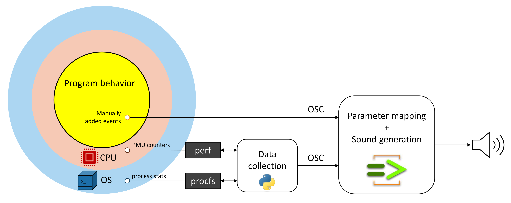
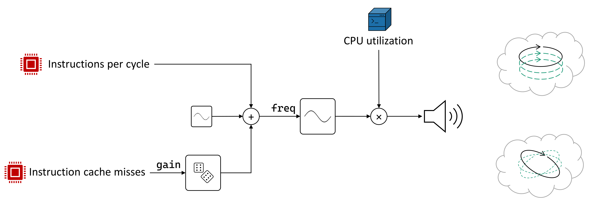
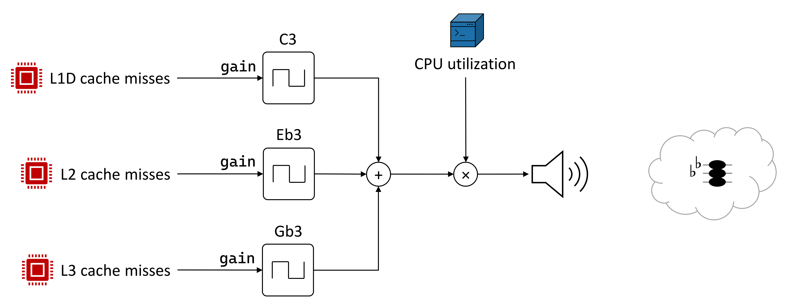
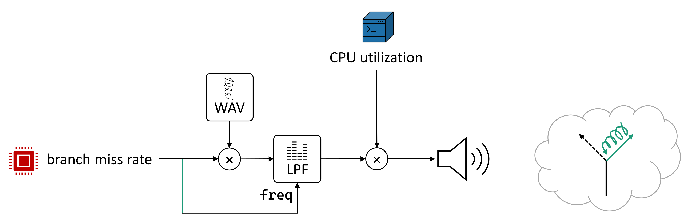
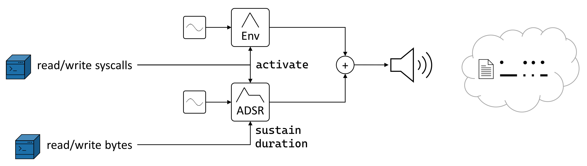
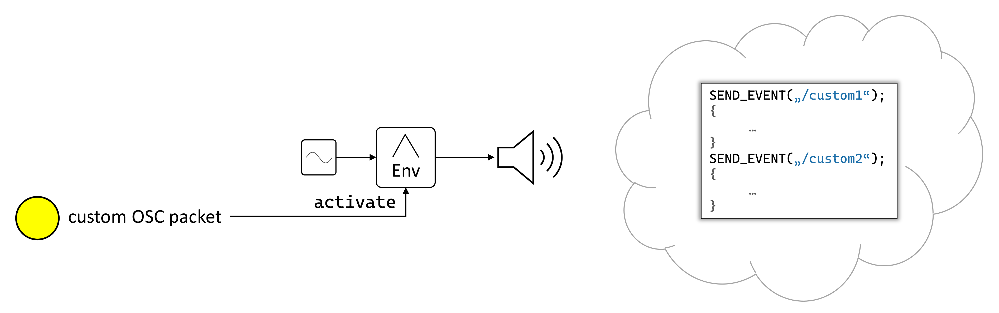

# Low-Level Program Sonification

This project allows you to hear your program's execution!

## Problem Statement

1. Really fast software requires anticipation of computer architecture. A developer needs to know what modern CPUs do and do not like. \
Typical pain-points include *cache locality*, *instruction-level parallelism*, *predictable branches*, *costly instructions* like integer division, *syscall overhead*, ...

2. CPUs operate at very high clock rates. The speed at which instructions are executed inhibits an intuitive understanding.

3. Existing tools for exploring low-level performance characteristics of a program are very detail-oriented. They fail to convey an aggregated impression while keeping time as a main dimension.

## Goal

Convey performance-related aspects of a program run using the auditory sense to create new insights that can help in manual optimization.

# Architecture



## Sound Mapping

### Instructions

When the recorded threads run, a spinning tone is emitted.
Its pitch depends on the effectiveness of the CPU, measured in Instructions per Cycle (IPC). A high tone implies a productive CPU, while a low tone suggests the CPU gets slowed down commonly.

The sound also conveys the locality of execution, measured via the miss rate of the instruction cache. If a tight loop is executed, the emitted tone will be very smooth.
If the control flow visits a large set of program locations, e.g. running through framework code, the tone will be shaky.




### Cache

Cache misses are mapped to a square wave reminiscent of a truck horn.
Each cache level is assigned a different pitch.
If many memory accesses miss all levels, a dramatic diminshed chord emerges.



### Branches

Branch misses are mapped to a cartoonish *\*boing\** sound that imitates a metallic spring. 
If some branch misses occur, the sound is quiet and muffled.
Branch miss rates in the realm of >20%, as encountered in loops with bad predictability, result in a very intense sound.



### IO

Programs can be slowed down due to IO operations, especially if inadequate buffering strategies are employed.
Each `read`/`write` syscall emits a short sound resembling keyhits on a retro-style typewriter. The buffer size of operations is indicated with an enlonged sound similar to that of a morse code radio device.

As system calls can be issued in a rate faster than even the sampling rate of hearable audio, calls happening in the same measurement window are aggregated to produce sound with increased volume.



### Custom events

If modification of the considered program is feasible, you can indicate the arrival of interesting checkpoints in your algorithm via an additional sound.
This is achieved by instrumenting the program to send an OSC packet (simple UDP protocol) to the sonification engine.



# Usage

### Prerequisites

This prototype is developed for linux.
The following software is needed

- [chuck](https://chuck.cs.princeton.edu/)
- perf: Install using
```bash
apt-get install linux-tools-common linux-tools-generic linux-tools-`uname -r`
```
- python3
- CMake

### Getting Started

1. Build the data collection tool:
```bash
$ cd ./sonification/data-collection
$ mkdir build && cd build
$ cmake .. -DCMAKE_BUILD_TYPE=Release
$ make
```

2. Start the ChucK synthesizer:
```bash
$ cd ./sonification/sound-synthesis
$ ./chuck.sh
```

3. Start the data collection:
```bash
$ cd ./sonification/data-collection/build
$ python3 main.py
firefox
```
In the last line, you enter the program name or a comma separated list of process ids of the program that should be observed.